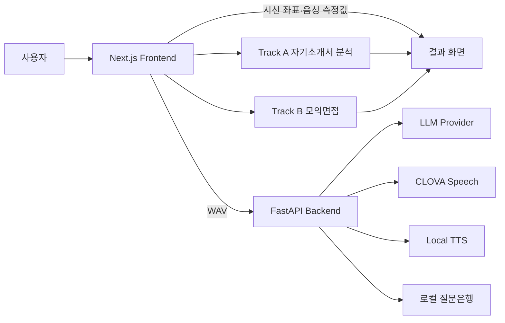

# InterReview

자기소개서 첨삭과 AI 모의면접을 하나의 흐름으로 제공하는 구직자용 면접 코칭 웹 서비스입니다. 사용자의 자기소개서와 지원 직무를 바탕으로 질문을 구성하고, 답변 내용·음성 활동·시선 패턴을 서로 다른 근거로 확인할 수 있게 합니다.

## 1. 프로젝트 배경

### 1.1. 국내외 시장 현황 및 문제점

기존 자기소개서 첨삭 서비스와 모의면접 서비스는 대체로 분리되어 있어, 사용자가 자기소개서에서 찾은 보완점을 실제 면접 질문과 답변 연습으로 이어가기 어렵습니다. 또한 생성형 AI가 만든 질문이나 피드백은 입력 근거가 불분명할 수 있고, 음성·시선 같은 측정값을 단일 점수로 합치면 해석이 과도해질 수 있습니다.

### 1.2. 필요성과 기대효과

InterReview는 같은 자기소개서 원문과 지원 직무를 Track A와 Track B가 함께 사용하도록 설계했습니다. 사용자는 자기소개서의 설명 부족 지점을 확인한 뒤 근거 기반 질문으로 면접을 연습하고, 답변 내용 피드백과 음성·시선 시각화를 통해 스스로 보완할 지점을 찾을 수 있습니다.

## 2. 개발 목표

### 2.1. 목표 및 세부 내용

- **Track A - 자기소개서 첨삭:** 경험별 약점과 예상 질문을 생성하고, 근거가 되는 원문을 하이라이트합니다.
- **Track B - 모의면접:** 여섯 도메인의 질문을 구성하고, 자기소개서 답변에 근거한 질문을 최대 두 개까지 반영합니다.
- **답변 내용 피드백:** 질문-요구 부합도, 근거의 타당성·구체성, 논리적 구성·명료성을 독립적으로 판정해 요약·잘한 점·개선점을 제공합니다.
- **음성·시선 확인:** 발화·무음 타임라인, 발화 속도와 질문별 시선 Heatmap을 제공합니다.
- **안정적인 진행:** 질문 생성, STT 또는 LLM 호출이 실패해도 가능한 범위에서 면접 세션을 계속합니다.

### 2.2. 기존 서비스 대비 차별성

- 자기소개서 첨삭과 모의면접을 하나의 사용자 흐름으로 연결합니다.
- 질문은행 여섯 문항을 먼저 확보한 뒤 검증된 근거 기반 질문만 교체해 `4+2`, `5+1`, `6+0` fallback을 유지합니다.
- 생성 질문의 근거가 실제 지원자 답변에 있는지 검증하며 기업 문항 자체는 근거로 사용하지 않습니다.
- 답변 내용은 고정된 세 항목으로 평가하되 총점·등급·합격 가능성을 만들지 않습니다.
- 음성과 시선은 채점하지 않고 측정값과 시각화만 제공합니다.

### 2.3. 사회적 가치 도입 계획

- 채용 판정이 아닌 구직자의 자기점검과 반복 연습을 지원합니다.
- 원본 영상은 백엔드에 저장하지 않고, API 키와 개인 데이터는 로컬 환경에서 분리 관리합니다.
- 측정값으로 성격·감정·채용 적합도를 추론하지 않아 과도한 자동 판단을 방지합니다.
- 외부 서비스 실패 시 내용을 꾸며내지 않고 명시적인 fallback을 제공합니다.

## 3. 시스템 설계

### 3.1. 시스템 구성도



브라우저는 카메라·마이크 입력, 녹음, VAD, 시선 좌표 수집과 결과 시각화를 담당합니다. 백엔드는 질문 선택·개인화, 자기소개서 분석, STT·TTS, 답변 리뷰와 측정값 집계를 담당합니다.

### 3.2. 사용 기술

| 구분 | 기술 |
| --- | --- |
| Frontend | Next.js 16, React 19, TypeScript, Tailwind CSS |
| Backend | Python 3.12+, FastAPI, Pydantic, uv |
| AI | Anthropic 또는 Gemini LLM, structured output 및 fallback |
| Speech | CLOVA Speech STT, Supertonic 3 Local TTS, Silero VAD |
| Vision | MediaPipe Face Landmarker, 시선 보정·EMA 평활화·Heatmap |
| Test | pytest, ESLint, TypeScript, Node test, Next.js production build |

## 4. 개발 결과

### 4.1. 전체 시스템 흐름도

```text
지원 직무·자기소개서 입력
├─ Track A: 원문 분석 → 경험별 보완점·예상 질문 → 원문 하이라이트
└─ Track B: 질문은행 6문항 선택 → 근거 기반 질문 최대 2개 교체
             → 장치 설정·시선 보정 → 질문별 답변
             → STT·답변 리뷰·음성 측정·시선 Heatmap → 결과
```

### 4.2. 기능 설명 및 주요 기능 명세서

| 기능 | 입력 | 출력 |
| --- | --- | --- |
| 자기소개서 분석 | 지원 직무, 자유 형식 또는 기업 문항별 답변 | 경험별 약점, 예상 질문, 원문 하이라이트 |
| 질문 구성 | 지원자 정보, 자기소개서 답변 | 6개 도메인의 질문과 보존된 원문 질문 |
| 면접 진행 | 카메라·마이크, 질문별 답변 | 질문별 WAV, 음성 활동, 시선 Heatmap |
| STT | 질문별 오디오 | 답변 리뷰용 전사문 |
| 답변 리뷰 | 질문, 전사문, 지원자 맥락 | 요약, 잘한 점, 개선점 |
| 측정값 집계 | 질문별 음성·시선 결과 | 질문별 결과와 세션 요약 |

주요 API는 `POST /essay/analyze`, `POST /questions`, `POST /tts`, `POST /stt`, `POST /answers/review`, `POST /measurements`입니다. 실행 중인 백엔드의 `http://localhost:8000/docs`에서 요청·응답 스키마를 확인할 수 있습니다.

### 4.3. 디렉터리 구조

```text
backend/     FastAPI API, LLM·질문·STT·TTS·측정 서비스, 테스트
frontend/    Next.js UI, 녹음·VAD·시선 분석, 프론트엔드 테스트
docs/        개발 계획과 제출 보고서·포스터·발표자료
```

질문은행 실데이터, 평가 데이터, 로컬 TTS 가중치, `.env*` 파일은 저장소에 포함하지 않습니다. `backend/question_bank_templates/`에는 문항이 없는 빈 배열(`[]`) 템플릿만 제공합니다.

### 4.4. 산업체 멘토링 의견 및 반영 사항

| 의견 | 반영 내용 |
| --- | --- |
| 기업의 채용 판정보다 구직자 코칭과 자기점검에 집중 | 자기소개서 첨삭을 독립된 Track A로 확정하고 총점·합격 가능성 예측을 제외 |
| 답변 텍스트 평가 기준과 산출 방법 구체화 | 세 평가 항목과 각 0·1·2점 기준을 고정하고 판정 근거를 피드백 생성에 사용 |
| 답변 내용, 음성, 시선 결과의 의미를 구분 | 내용 피드백과 음성 활동·발화 속도·시선 Heatmap을 분리 표시 |

## 5. 설치 및 실행 방법

### 5.1. 설치 절차 및 실행 방법

필수 환경은 Python 3.12 이상, [uv](https://docs.astral.sh/uv/), Node.js입니다. 질문은행 데이터와 TTS 모델은 저장소 외부에서 별도로 준비해야 합니다.

백엔드:

```powershell
cd backend
uv sync

# 빈 질문은행 배치: 기존 파일이 있으면 덮어쓰지 않습니다.
New-Item -ItemType Directory -Force question_banks/ict/new | Out-Null
Get-ChildItem question_bank_templates/*.json | ForEach-Object {
    $destination = Join-Path question_banks/ict/new $_.Name
    if (-not (Test-Path -LiteralPath $destination)) {
        Copy-Item -LiteralPath $_.FullName -Destination $destination
    }
}

# backend/.env를 로컬에서 직접 만들고 필요한 값만 설정합니다.
# 예: LLM_PROVIDER, ANTHROPIC_API_KEY 또는 GEMINI_API_KEY,
#     CLOVA_SPEECH_INVOKE_URL, CLOVA_SPEECH_SECRET

# 별도로 확보한 사용 가능한 문항을 로컬 질문은행에 채운 후 검증
uv run python tools/validate_ict_question_bank.py

# 로컬 TTS 모델 설치
uv run python tools/install_local_tts.py

uv run uvicorn app.main:app --reload --port 8000
```

빈 템플릿은 경로와 JSON 형식만 준비합니다. **빈 상태에서는 질문 생성 API가 오류를 반환하므로 면접 진행에는 여섯 파일 모두 실제 문항이 필요합니다.** 파일명은 `resume.json`, `motivation_commitment.json`, `job_technology.json`, `problem_solving.json`, `collaboration_organization.json`, `values_personality.json`입니다. 문항 스키마는 [질문은행 검증 도구](backend/tools/validate_ict_question_bank.py)를 참고하세요. 데이터를 넣을 곳은 Git에서 제외되는 `backend/question_banks/ict/new/`이며, 공개 템플릿에는 문항을 넣지 않습니다. 데이터 준비 후 백엔드를 재시작하세요. 외부 경로를 사용할 때는 `new/`의 상위 디렉터리를 `QUESTION_BANK_ROOT`로 지정합니다.

프론트엔드:

```powershell
cd frontend
npm.cmd ci
npm.cmd run dev
```

브라우저에서 [http://localhost:3000](http://localhost:3000)에 접속합니다. 카메라와 마이크는 `localhost` 또는 HTTPS 환경에서 사용할 수 있습니다.

검증:

```powershell
# backend
uv run pytest

# frontend
npm.cmd run lint
npx.cmd tsc --noEmit
node --test lib/*.test.mts
npm.cmd run build
```

### 5.2. 오류 발생 시 해결 방법

- 질문 생성이 실패하면 질문은행 데이터가 `backend/question_banks/ict/new/`에 준비되었는지 확인합니다.
- LLM 또는 STT가 `not_configured`를 반환하면 로컬 `backend/.env`의 공급자·키 설정을 확인하고 백엔드를 완전히 재시작합니다.
- TTS 모델이 없으면 `backend`에서 `uv run python tools/install_local_tts.py`를 실행합니다.
- 프론트엔드가 백엔드에 연결되지 않으면 백엔드의 8000번 포트와 프론트엔드의 `/api` 프록시 설정을 확인합니다.
- 카메라·마이크가 동작하지 않으면 브라우저 권한과 `localhost` 또는 HTTPS 접속 여부를 확인합니다.

## 6. 소개 자료 및 시연 영상

### 6.1. 프로젝트 소개 자료

- [최종보고서](docs/01.보고서/03.최종보고서.pdf)
- [포스터](docs/02.포스터/포스터파일.pdf)
- [발표자료 PDF](docs/03.발표자료/발표자료.pdf)
- [발표자료 PPTX](docs/03.발표자료/발표자료.pptx)

### 6.2. 시연 영상

최종 공개 링크가 확정되면 이 항목에 추가합니다.

## 7. 팀 구성

### 7.1. 팀원별 소개 및 역할 분담

| 팀원 | 역할 | 담당 내용 |
| --- | --- | --- |
| 최재용 | Track B 면접·Multimodal | 질문은행 정제와 4+2 질문 연동, 면접 상태 흐름, 녹음·STT, Silero VAD, MediaPipe 시선 분석·Heatmap, Local TTS 통합 |
| 이정원 | Track A·공용 LLM·웹 흐름 | 자기소개서 분석·하이라이트, 질문 생성·개인화, 공용 LLM 계층과 fallback, 답변 루브릭·내용 리뷰, 지원자 입력·결과 UI |
| 공동 | 설계·통합·발표 | 데이터 계약, 개인정보·fallback 원칙, 전체 사용자 흐름 통합, 문서화와 발표 준비 |

### 7.2. 팀원별 참여 후기

- **최재용:** 실제 브라우저 장치와 AI 서비스를 연결하면서 정상 경로뿐 아니라 무음·장치 권한·외부 API 실패를 함께 다루는 것이 안정적인 사용자 경험에 중요함을 확인했습니다.
- **이정원:** 생성형 AI의 결과를 그대로 보여주기보다 원문 근거, 고정된 평가 기준과 실패 시 fallback을 명시해야 사용자가 결과를 신뢰하고 해석할 수 있음을 확인했습니다.

## 8. 참고 문헌 및 출처

- [FastAPI](https://fastapi.tiangolo.com/)
- [Next.js](https://nextjs.org/docs)
- [MediaPipe Face Landmarker](https://ai.google.dev/edge/mediapipe/solutions/vision/face_landmarker)
- [Silero VAD](https://github.com/snakers4/silero-vad)
- [CLOVA Speech](https://api.ncloud-docs.com/docs/ai-application-service-clovaspeech)
- [uv](https://docs.astral.sh/uv/)

## 저장소 보안 및 데이터 정책

- API 키는 로컬 환경변수에서만 읽으며 `.env*` 파일은 커밋하지 않습니다.
- 질문은행, 평가 데이터, 녹음·영상과 로컬 TTS 가중치는 저장소에 포함하지 않습니다.
- 원본 오디오·영상은 불필요하게 영구 저장하지 않습니다.

## Supertonic 3 사용 및 라이선스 고지

InterReview는 **Supertone Inc.의 Supertonic 3를 로컬 TTS 구성 요소로 통합하여 사용**합니다. 면접 질문과 진행 안내 음성은 사람이 녹음한 발화가 아닌 **AI가 생성한 합성 음성**입니다. 모델 가중치는 이 Git 저장소에 내장·커밋하지 않으며, [설치 도구](backend/tools/install_local_tts.py)가 공식 모델 저장소에서 내려받아 실행 환경에 설치합니다.

- **모델:** `Supertone/supertonic-3`, revision `724fb5abbf5502583fb520898d45929e62f02c0b`. [공식 모델 라이선스](https://huggingface.co/Supertone/supertonic-3/blob/724fb5abbf5502583fb520898d45929e62f02c0b/LICENSE)는 **BigScience Open RAIL-M License**(2022-08-18)이며, [동봉한 전문](licenses/Supertonic-3-Open-RAIL-M.txt)을 확인하세요.
- **Python SDK:** `supertonic==1.3.1`. [공식 SDK 라이선스](https://github.com/supertone-oss-archive/supertonic-py/blob/v1.3.1/LICENSE)는 **MIT License**, Copyright (c) 2025 Supertone Inc.이며, [동봉한 전문](licenses/Supertonic-Python-MIT.txt)을 확인하세요.

모델 사용에는 Open RAIL-M 제5항과 Attachment A의 사용 제한이 적용됩니다. 모델 사용자도 이를 준수해야 하며, 합성 음성임을 명확하게 알리고 무단 사칭·유해한 허위 정보 생성 등 금지된 목적으로 사용해서는 안 됩니다. 전체 제한은 라이선스 전문이 기준입니다.

모델을 포함한 배포본이나 원격 서비스를 제공할 때에는 제4항에 따라 라이선스 사본과 관련 권리·출처 고지를 보존하고, 사용 제한을 이용·배포 계약의 집행 가능한 조항으로 반영하여 후속 사용자에게 고지해야 합니다. 모델 파일을 수정한 경우 변경 사실도 명시해야 합니다. SDK를 재배포할 때에는 MIT 저작권·허가 고지를 함께 보존해야 합니다. 이 안내는 InterReview 자체에 해당 라이선스를 일괄 적용한다는 의미가 아닙니다.

### 5.8. 유튜브 영상 추가

[](https://www.youtube.com/watch?v=4t1F1gKlFFE&list=PLO6qooGfURhY&index=16)
